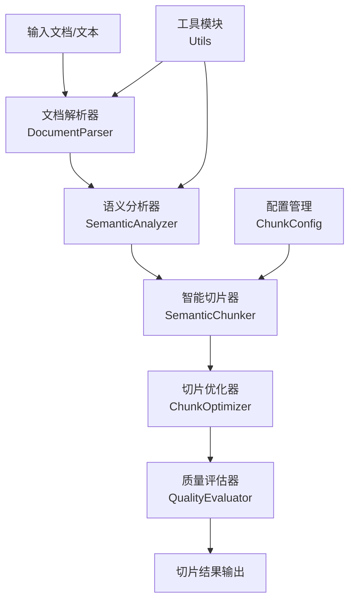

# 🔥 AntSK 语义文本切片服务

<div align="center">


**基于语义理解的智能文本切片服务，专为 RAG 应用优化**

[快速开始](#快速开始) • [功能特性](#核心特性) • [API文档](#api-服务) • [使用指南](#使用指南) • [项目文档](docs/)

</div>

## 📖 项目简介

AntSK-FileChunk 是一个基于深度语义理解的智能文本切片服务，专门解决传统基于固定长度或简单分隔符切片导致的**语义割裂问题**。该服务通过先进的语义分析技术，能够智能识别文本的语义边界，确保每个切片在语义上的完整性和连贯性。

### 🎯 核心价值
- 🧠 **语义完整性**: 基于语义相似度进行智能边界检测，避免语义单元被割裂
- 📚 **多格式支持**: 支持 PDF、Word、TXT 等多种文档格式的智能解析
- ⚡ **高效处理**: 优化的算法设计，支持大文档的快速处理
- 🎛️ **灵活配置**: 丰富的参数配置，适应不同应用场景需求
- 🔗 **API优先**: 完整的 RESTful API 和 Web 界面，易于集成

## 🏗️ 系统架构



### 核心组件
- **SemanticChunker**: 主控制器，协调整个切片流程
- **DocumentParser**: 文档解析器，支持多种格式文档解析
- **SemanticAnalyzer**: 语义分析器，基于 Transformer 模型进行语义向量计算
- **ChunkOptimizer**: 切片优化器，对初步切片结果进行优化处理
- **QualityEvaluator**: 质量评估器，提供切片质量评估和统计分析

## ✨ 核心特性

### 🔬 智能语义切片
- **语义边界检测**: 使用 SentenceTransformer 模型计算语义向量，通过余弦相似度识别语义边界
- **多层决策机制**: 结合长度约束、语义阈值、段落结构等多重因素进行切片决策
- **上下文保持**: 支持切片间重叠，保持上下文连续性，提升检索效果

### 📄 强大文档解析
- **多格式支持**: PDF、Word(.docx)、纯文本(.txt) 
- **结构保持**: 智能识别并保持文档的章节、段落、表格等结构信息
- **内容清洗**: 自动处理特殊字符、空白、格式化等问题

### ⚙️ 灵活参数配置
```python
@dataclass
class ChunkConfig:
    min_chunk_size: int = 500        # 最小切片大小
    max_chunk_size: int = 3000       # 最大切片大小  
    target_chunk_size: int = 1800    # 目标切片大小
    semantic_threshold: float = 0.6   # 语义相似度阈值
    overlap_ratio: float = 0.1        # 重叠比例
    language: str = "zh"             # 语言设置 (zh/en)
    preserve_structure: bool = True   # 保持文档结构
```

### 🎖️ 质量保证体系
- **多维评估**: 语义连贯性、长度分布、Token 统计等多维度质量评估
- **统计分析**: 完整的切片质量统计信息和可视化
- **优化建议**: 基于质量评估提供参数优化建议

## 📁 项目结构

```
AntSK-FileChunk/
├── 📦 src/antsk_filechunk/        # 核心包
│   ├── core/                      # 核心功能
│   │   └── semantic_chunker.py    # 主控制器
│   ├── parsers/                   # 解析器
│   │   └── document_parser.py     # 文档解析
│   ├── analyzers/                 # 分析器
│   │   └── semantic_analyzer.py   # 语义分析
│   ├── optimizers/               # 优化器
│   │   └── chunk_optimizer.py    # 切片优化
│   ├── evaluators/               # 评估器
│   │   └── quality_evaluator.py  # 质量评估
│   └── utils/                    # 工具模块
├── 🚀 api_server.py              # FastAPI 服务器
├── 🎛️ start_server.py            # 启动脚本
├── 📚 examples/                   # 示例代码
│   ├── demo.py                   # 演示脚本
│   └── data/                     # 示例数据
├── 🧪 tests/                     # 测试套件
│   ├── unit/                     # 单元测试
│   ├── integration/              # 集成测试
│   └── fixtures/                 # 测试数据
├── 📖 docs/                      # 文档目录
│   ├── 语义切片逻辑详解.md        # 算法详解
│   ├── API_README.md            # API文档
│   └── 优化建议.md               # 优化指南
├── 🔧 scripts/                   # 工具脚本
│   └── cli.py                    # 命令行工具
├── ⚙️ config/                    # 配置文件
└── 🌐 templates/                 # Web界面模板
```

## 🚀 快速开始

### 环境要求
- Python 3.8+
- 8GB+ RAM (推荐)
- CUDA GPU (可选，加速语义向量计算)

### 1. 安装依赖

```bash
# 克隆项目
git clone https://github.com/xuzeyu91/AntSK-FileChunk.git
cd AntSK-FileChunk

# 安装依赖
pip install -r requirements.txt

# 或者使用开发模式安装
pip install -e .
```

### 2. 基础使用

#### Python API
```python
from src.antsk_filechunk import SemanticChunker, ChunkConfig

# 使用默认配置
chunker = SemanticChunker()

# 处理文件
chunks = chunker.process_file("document.pdf")

# 处理纯文本
text = "长篇文档内容..."
chunks = chunker.process_text(text)

# 查看结果
for i, chunk in enumerate(chunks):
    print(f"切片 {i+1}:")
    print(f"  内容: {chunk.content[:100]}...")
    print(f"  语义得分: {chunk.semantic_score:.3f}")
    print(f"  长度: {len(chunk.content)} 字符")
    print(f"  Token数: {chunk.token_count}")
    print("-" * 50)
```

#### 自定义配置
```python
# 创建自定义配置
config = ChunkConfig(
    target_chunk_size=1200,      # 目标切片大小
    semantic_threshold=0.7,       # 提高语义阈值
    language="zh",               # 中文处理
    overlap_ratio=0.15           # 增加重叠比例
)

chunker = SemanticChunker(config=config)
chunks = chunker.process_file("document.pdf")
```

### 3. 命令行使用

```bash
# 基本用法
python scripts/cli.py document.pdf --output result.json

# 自定义参数
python scripts/cli.py document.pdf \
    --target-size 1200 \
    --semantic-threshold 0.7 \
    --overlap 0.15 \
    --language zh \
    --output result.json

# 查看帮助
python scripts/cli.py --help
```

## 🌐 API 服务

### 启动服务
```bash
# 启动 FastAPI 服务器
python start_server.py

# 服务地址
# - Web界面: http://localhost:8000
# - API文档: http://localhost:8000/docs  
# - ReDoc: http://localhost:8000/redoc
```

### API 端点

#### 📤 文件上传处理
```http
POST /api/process-file
Content-Type: multipart/form-data

Parameters:
- file: 上传的文件 (PDF/Word/TXT)
- config: 切片配置 (JSON, 可选)
```

#### 📝 文本内容处理  
```http
POST /api/process-text
Content-Type: application/json

{
    "text": "要处理的文本内容",
    "config": {
        "target_chunk_size": 1200,
        "semantic_threshold": 0.7,
        "language": "zh"
    }
}
```

#### 💾 获取默认配置
```http
GET /api/config/default
```

#### ❤️ 健康检查
```http
GET /health
```

### 响应格式
```json
{
    "success": true,
    "message": "处理完成",
    "chunks": [
        {
            "content": "切片内容...",
            "start_pos": 0,
            "end_pos": 156,
            "semantic_score": 0.85,
            "token_count": 42,
            "paragraph_indices": [0, 1, 2],
            "chunk_type": "content",
            "metadata": {}
        }
    ],
    "total_chunks": 5,
    "processing_time": 2.34,
    "file_info": {
        "filename": "document.pdf",
        "size": 1024000,
        "format": "pdf"
    }
}
```

## 📊 使用指南

### 算法工作流程

1. **📄 文档解析**: 解析多种格式文档，提取文本和结构信息
2. **🧠 语义分析**: 计算段落级语义向量，构建语义相似度矩阵
3. **✂️ 智能切片**: 基于语义边界和长度约束进行智能切片
4. **🔧 切片优化**: 合并过小切片，分割过大切片，优化边界
5. **📈 质量评估**: 评估切片质量，提供统计信息和优化建议

### 参数调优指南

#### 基础场景配置
```python
# RAG检索优化 - 平衡语义完整性和检索粒度
config = ChunkConfig(
    target_chunk_size=1000,
    semantic_threshold=0.65,
    overlap_ratio=0.1
)

# 问答系统 - 更小粒度，更高重叠
config = ChunkConfig(
    target_chunk_size=600,
    semantic_threshold=0.7,
    overlap_ratio=0.2
)

# 文档总结 - 更大切片，保持完整语义单元
config = ChunkConfig(
    target_chunk_size=2000,
    semantic_threshold=0.55,
    overlap_ratio=0.05
)
```

#### 语言特定优化
```python
# 中文文档
config = ChunkConfig(
    language="zh",
    target_chunk_size=1200,  # 中文字符密度更高
    semantic_threshold=0.6
)

# 英文文档  
config = ChunkConfig(
    language="en",
    target_chunk_size=800,   # 英文词汇更长
    semantic_threshold=0.7
)
```

### 质量评估指标

- **语义连贯性得分**: 0-1，越高表示切片内语义越连贯
- **长度分布**: 切片长度的统计分布情况
- **Token估算**: 各切片的Token数量估算
- **边界质量**: 切片边界的语义合理性评分

## 🧪 测试

### 运行测试套件
```bash
# 运行所有测试
python -m pytest tests/ -v

# 运行单元测试
python -m pytest tests/unit/ -v

# 运行集成测试
python -m pytest tests/integration/ -v

# 生成覆盖率报告
python -m pytest tests/ --cov=src --cov-report=html
```

### 性能测试
```bash
# 测试切片长度分布
python test_chunk_length.py

# 测试语义完整性
python test_semantic_integrity.py

# API性能测试
python test_api.py
```

## 📈 性能特性

### 计算复杂度
- **语义向量计算**: O(n) - 段落数量线性增长  
- **相似度计算**: O(k) - k为每个切片的段落数
- **总体复杂度**: O(n) - 对大文档处理友好

### 内存优化
- **批处理**: 语义向量批量计算，减少显存占用
- **向量归一化**: 减少存储空间，提高计算效率  
- **流式处理**: 支持大文档的分段处理

### 模型优化
- **轻量级模型**: 默认使用 MiniLM 模型，平衡效果与速度
- **模型缓存**: 模型加载后缓存，避免重复加载
- **容错机制**: 多个备选模型，确保服务可用性

## 🛠️ 高级用法

### 自定义语义模型
```python
from sentence_transformers import SentenceTransformer

# 使用自定义模型
custom_model = SentenceTransformer('your-model-name')
analyzer = SemanticAnalyzer(model=custom_model)
chunker = SemanticChunker(analyzer=analyzer)
```

### 批量处理
```python
import os
from pathlib import Path

chunker = SemanticChunker()

# 批量处理文件夹中的所有文档
input_folder = Path("documents/")
output_folder = Path("chunks/")

for file_path in input_folder.glob("*.pdf"):
    chunks = chunker.process_file(file_path)
    
    # 保存结果
    output_file = output_folder / f"{file_path.stem}_chunks.json"
    chunker.save_chunks(chunks, output_file)
    
    print(f"处理完成: {file_path.name} -> {len(chunks)} 个切片")
```

### 切片后处理
```python
# 获取统计信息
stats = chunker.get_chunking_statistics(chunks)
print(f"平均语义得分: {stats['avg_semantic_score']:.3f}")

# 过滤低质量切片
high_quality_chunks = [
    chunk for chunk in chunks 
    if chunk.semantic_score > 0.7 and len(chunk.content) > 200
]

# 导出为不同格式
chunker.export_to_csv(chunks, "chunks.csv")
chunker.export_to_jsonl(chunks, "chunks.jsonl")
```

## 🤝 贡献指南

### 开发环境设置
```bash
# 克隆项目
git clone https://github.com/antsk/AntSK-FileChunk.git
cd AntSK-FileChunk

# 创建虚拟环境
python -m venv venv
source venv/bin/activate  # Windows: venv\Scripts\activate

# 安装开发依赖
pip install -e ".[dev]"

# 运行预提交检查
pre-commit install
```

### 代码风格
```bash
# 代码格式化
black src/ tests/ scripts/

# 代码检查
flake8 src/ tests/ scripts/

# 类型检查
mypy src/
```

## 📄 许可证

本项目采用 [MIT License](LICENSE) 开源许可证。

## 🙏 致谢

感谢以下开源项目：
- [Sentence Transformers](https://www.sbert.net/) - 语义向量计算
- [PyMuPDF](https://pymupdf.readthedocs.io/) - PDF文档解析
- [python-docx](https://python-docx.readthedocs.io/) - Word文档解析
- [FastAPI](https://fastapi.tiangolo.com/) - API服务框架
- [scikit-learn](https://scikit-learn.org/) - 机器学习工具

## 📞 联系我们

- 📧 邮箱: antskpro@qq.com
- 🐛 问题报告: [GitHub Issues](https://github.com/xuzeyu91/AntSK-FileChunk/issues)
- 💬 讨论交流: [GitHub Discussions](https://github.com/xuzeyu91/AntSK-FileChunk/discussions)

---

<div align="center">

**如果这个项目对您有帮助，请给我们一个 ⭐ Star！**

Made with ❤️ by AntSK Team

</div>
