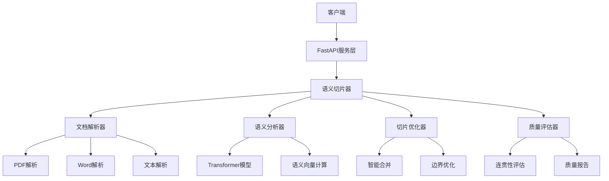

# AntSK-FileChunk 语义文本切片服务

<div align="center">


**基于语义理解的智能文本切片服务**

[功能特性](#功能特性) • [快速开始](#快速开始) • [API文档](#api文档) • [技术架构](#技术架构) • [使用示例](#使用示例)

</div>

## 📖 项目简介

AntSK-FileChunk 是一个基于语义理解的智能文本切片服务，专门用于处理长文档的语义分割。与传统的基于Token数量或固定长度的切分方式不同，本项目采用先进的语义分析技术，确保每个切片在语义上的完整性和连贯性。

### 🎯 解决的问题

- **语义割裂**：传统切分方法容易在句子或段落中间切断，破坏语义完整性
- **上下文丢失**：固定长度切分无法保持相关内容的关联性
- **格式处理**：难以处理复杂文档格式（PDF、Word）中的表格、图片等特殊内容
- **质量评估**：缺乏有效的切片质量评估和优化机制

## ✨ 功能特性

### 🧠 核心功能
- **语义感知切片**：基于Transformer模型进行语义理解，确保切片边界的合理性
- **多格式支持**：支持PDF、Word（.docx/.doc）、纯文本等多种文档格式
- **智能文档解析**：自动识别和处理文档结构、表格、图片等特殊内容
- **自适应切片**：根据内容特点动态调整切片大小，平衡语义完整性和处理效率

### 🚀 增强功能
- **缓存机制**：LRU缓存策略，避免重复计算语义向量，提升处理速度
- **质量评估**：多维度切片质量评估体系，提供优化建议
- **异常处理**：完善的降级策略，确保服务稳定性
- **多语言支持**：支持中文和英文文档处理

### 🌐 服务特性
- **RESTful API**：完整的HTTP API接口，支持文件上传和文本直接处理
- **Web界面**：友好的Web操作界面，支持在线测试和配置
- **命令行工具**：便捷的CLI工具，支持批量处理
- **Docker部署**：容器化部署，简化运维管理

## 🚀 快速开始

### 环境要求

- Python 3.8+
- 内存：建议4GB以上
- 存储：预留2GB空间用于模型文件

### 安装步骤

1. **克隆项目**
```bash
git clone https://github.com/xuzeyu91/AntSK-FileChunk.git
cd AntSK-FileChunk
```

2. **安装依赖**
```bash
pip install -r requirements.txt
```

3. **启动服务**
```bash
python start_server.py
```

4. **访问服务**
- Web界面：http://localhost:8000
- API文档：http://localhost:8000/docs
- 健康检查：http://localhost:8000/health

### 快速测试

```bash
# 运行演示程序
python examples/demo.py

# 使用命令行工具
python scripts/cli.py --input document.pdf --output chunks.json

# 处理文本文件
python scripts/cli.py --input text.txt --min-size 200 --max-size 1000
```

## 🏗️ 技术架构

### 系统架构图



### 核心组件

| 组件 | 功能描述 | 技术栈 |
|------|----------|--------|
| **DocumentParser** | 文档解析和内容提取 | PyMuPDF, python-docx |
| **SemanticAnalyzer** | 语义向量计算和相似度分析 | sentence-transformers, scikit-learn |
| **ChunkOptimizer** | 切片优化和边界调整 | 自研算法 |
| **QualityEvaluator** | 切片质量评估和优化建议 | 多维度评估指标 |
| **EnhancedSemanticChunker** | 增强版切片器，集成所有功能 | 完整的切片解决方案 |

### 算法流程

1. **文档解析**：提取段落、表格、图片等结构化信息
2. **文本预处理**：清理噪声、标准化格式、分段处理
3. **语义分析**：计算段落语义向量，识别语义边界
4. **智能切片**：基于语义阈值和长度约束进行切片
5. **优化处理**：合并小切片、分割大切片、调整边界
6. **质量评估**：评估连贯性、完整性、平衡性等指标

## 📚 API文档

### 核心接口

#### 1. 文件处理接口

```http
POST /api/process-file
Content-Type: multipart/form-data

参数：
- file: 上传的文件（支持PDF、Word、TXT）
- config: 可选的配置JSON字符串
```

**响应示例：**
```json
{
  "success": true,
  "message": "文件处理成功",
  "chunks": [
    {
      "content": "这是第一个切片的内容...",
      "start_pos": 0,
      "end_pos": 150,
      "semantic_score": 0.85,
      "token_count": 120,
      "paragraph_indices": [0, 1],
      "chunk_type": "content",
      "metadata": {}
    }
  ],
  "total_chunks": 5,
  "processing_time": 2.3,
  "file_info": {
    "filename": "document.pdf",
    "size": 1024000,
    "type": ".pdf"
  }
}
```

#### 2. 文本处理接口

```http
POST /api/process-text
Content-Type: application/x-www-form-urlencoded

参数：
- text: 要处理的文本内容
- config: 可选的配置JSON字符串
```

#### 3. 配置获取接口

```http
GET /api/config/default
```

### 配置参数说明

| 参数 | 类型 | 默认值 | 说明 |
|------|------|--------|------|
| `min_chunk_size` | int | 200 | 最小切片字符数 |
| `max_chunk_size` | int | 1500 | 最大切片字符数 |
| `target_chunk_size` | int | 800 | 目标切片字符数 |
| `overlap_ratio` | float | 0.1 | 重叠比例 |
| `semantic_threshold` | float | 0.7 | 语义相似度阈值 |
| `paragraph_merge_threshold` | float | 0.8 | 段落合并阈值 |
| `language` | string | "zh" | 语言设置（zh/en） |
| `preserve_structure` | bool | true | 是否保持文档结构 |
| `handle_special_content` | bool | true | 是否处理特殊内容 |

## 💡 使用示例

### Python SDK使用

```python
from src.antsk_filechunk import SemanticChunker, ChunkConfig

# 基础使用
chunker = SemanticChunker()
chunks = chunker.process_file("document.pdf")

for chunk in chunks:
    print(f"内容: {chunk.content[:100]}...")
    print(f"语义得分: {chunk.semantic_score:.3f}")
    print(f"Token数: {chunk.token_count}")
    print("-" * 50)
```

### 自定义配置

```python
# 创建自定义配置
config = ChunkConfig(
    min_chunk_size=300,
    max_chunk_size=1200,
    target_chunk_size=800,
    semantic_threshold=0.75,
    language="zh"
)

# 使用增强版切片器
from src.antsk_filechunk import EnhancedSemanticChunker

chunker = EnhancedSemanticChunker(
    config=config,
    cache_size=500,
    enable_fallback=True
)

# 启用增强功能
chunker.configure_coherence(
    position_weight_enabled=True,
    trend_analysis_enabled=True
)

# 处理文本
chunks = chunker.process_text_enhanced(text, use_cache=True)

# 获取统计信息
stats = chunker.get_comprehensive_stats()
health = chunker.health_check()
```

### 命令行使用

```bash
# 基础切片
python scripts/cli.py --input document.pdf --output result.json

# 自定义参数
python scripts/cli.py \
  --input document.pdf \
  --output result.json \
  --min-size 300 \
  --max-size 1200 \
  --semantic-threshold 0.75 \
  --language zh

# 批量处理
python scripts/cli.py --batch --input-dir ./documents --output-dir ./results
```

### HTTP API调用

```python
import requests

# 文件上传处理
with open('document.pdf', 'rb') as f:
    files = {'file': f}
    data = {
        'config': json.dumps({
            'min_chunk_size': 300,
            'max_chunk_size': 1200,
            'semantic_threshold': 0.75
        })
    }
    response = requests.post('http://localhost:8000/api/process-file', 
                           files=files, data=data)
    result = response.json()

# 文本直接处理
data = {
    'text': '这里是要处理的长文本内容...',
    'config': json.dumps({'target_chunk_size': 600})
}
response = requests.post('http://localhost:8000/api/process-text', data=data)
result = response.json()
```

## 🎯 应用场景配置

### 技术文档处理
```python
config = ChunkConfig(
    min_chunk_size=300,
    max_chunk_size=1200,
    target_chunk_size=800,
    semantic_threshold=0.8,
    preserve_structure=True
)
```

### 新闻文章处理
```python
config = ChunkConfig(
    min_chunk_size=150,
    max_chunk_size=600,
    target_chunk_size=350,
    semantic_threshold=0.7,
    handle_special_content=True
)
```

### 学术论文处理
```python
config = ChunkConfig(
    min_chunk_size=400,
    max_chunk_size=2000,
    target_chunk_size=1000,
    semantic_threshold=0.75,
    preserve_structure=True
)
```

## 🐳 Docker部署

### 快速开始

#### 方式一：使用 Docker Compose（推荐）

```bash
# 1. 克隆项目
git clone https://github.com/xuzeyu91/AntSK-FileChunk.git
cd AntSK-FileChunk

# 2. 启动服务
docker-compose up -d

# 3. 访问服务
# Web界面: http://localhost:8000
# API文档: http://localhost:8000/docs
```

#### 方式二：直接使用 Docker


```bash
docker-compose up -d --build
```


```bash
# 构建镜像
docker build -t antsk-filechunk:latest .

# 运行容器
docker run -d \
  --name antsk-filechunk \
  -p 8000:8000 \
  -v $(pwd)/temp:/app/temp \
  -v $(pwd)/config:/app/config \
  antsk-filechunk:latest
```

### 生产环境部署

#### 带 Nginx 反向代理

```bash
# 启动包含 Nginx 的完整服务
docker-compose --profile with-nginx up -d
```

#### 集群部署

```bash
# 使用 Docker Swarm
docker swarm init
docker stack deploy -c docker-compose.yml antsk-stack
```

### 配置选项

| 环境变量 | 默认值 | 说明 |
|----------|--------|------|
| `LOG_LEVEL` | `info` | 日志级别 |
| `HOST` | `0.0.0.0` | 服务监听地址 |
| `PORT` | `8000` | 服务端口 |

### 卷挂载

```bash
# 临时文件目录（必需）
-v $(pwd)/temp:/app/temp

# 配置文件目录（可选）
-v $(pwd)/config:/app/config

# 静态文件目录（可选）
-v $(pwd)/static:/app/static
```

### 健康检查

```bash
# 查看容器健康状态
docker inspect --format='{{.State.Health.Status}}' antsk-filechunk

# 手动健康检查
curl -f http://localhost:8000/health
```

📖 **详细部署指南**：查看 [Docker 部署文档](docs/DOCKER_DEPLOYMENT.md) 获取完整的部署说明、故障排除和最佳实践。

## 📊 性能指标

### 处理能力
- **文档解析速度**：~50页/秒（PDF），~100页/秒（Word）
- **语义分析速度**：~1000段落/秒
- **内存使用**：基础模型~2GB，增强模式~4GB
- **并发支持**：支持多线程处理，建议4-8个工作进程

### 质量指标
- **语义连贯性**：平均得分>0.8
- **切片平衡性**：长度方差<20%
- **边界准确性**：>95%的切片边界位于段落间

## 🔧 开发指南

### 项目结构

```
AntSK-FileChunk/
├── src/antsk_filechunk/          # 核心代码
│   ├── enhanced_semantic_chunker.py  # 增强版切片器
│   ├── document_parser.py        # 文档解析器
│   ├── semantic_analyzer.py      # 语义分析器
│   ├── chunk_optimizer.py        # 切片优化器
│   └── quality_evaluator.py      # 质量评估器
├── api_server.py                 # FastAPI服务
├── start_server.py              # 启动脚本
├── scripts/                     # 工具脚本
│   └── cli.py                   # 命令行工具
├── examples/                    # 使用示例
├── docs/                        # 文档
├── tests/                       # 测试用例
└── requirements.txt             # 依赖列表
```

### 开发环境设置

```bash
# 安装开发依赖
pip install -r requirements.txt
pip install -e .

# 运行测试
python -m pytest tests/

# 代码格式化
black src/ tests/
flake8 src/ tests/

# 类型检查
mypy src/
```

### 扩展开发

1. **自定义语义模型**：继承`SemanticAnalyzer`类
2. **新增文档格式**：扩展`DocumentParser`类
3. **优化算法**：修改`ChunkOptimizer`类
4. **质量评估**：扩展`QualityEvaluator`类

## 🤝 贡献指南

我们欢迎社区贡献！请遵循以下步骤：

1. Fork本项目
2. 创建特性分支 (`git checkout -b feature/AmazingFeature`)
3. 提交更改 (`git commit -m 'Add some AmazingFeature'`)
4. 推送到分支 (`git push origin feature/AmazingFeature`)
5. 创建Pull Request

### 贡献类型
- 🐛 Bug修复
- ✨ 新功能开发
- 📚 文档改进
- 🎨 代码优化
- 🧪 测试用例

## 📄 许可证

本项目采用MIT许可证 - 查看 [LICENSE](LICENSE) 文件了解详情。

## 📞 联系我们

- **项目主页**：https://github.com/antsk/AntSK-FileChunk
- **问题反馈**：https://github.com/antsk/AntSK-FileChunk/issues
- **邮箱**：antskpro@qq.com

## 🙏 致谢

感谢以下开源项目的支持：
- [sentence-transformers](https://github.com/UKPLab/sentence-transformers) - 语义向量计算
- [FastAPI](https://github.com/tiangolo/fastapi) - Web框架
- [PyMuPDF](https://github.com/pymupdf/PyMuPDF) - PDF处理
- [python-docx](https://github.com/python-openxml/python-docx) - Word文档处理

---

<div align="center">

**如果这个项目对您有帮助，请给我们一个⭐️**

Made with ❤️ by AntSK Team

</div>
